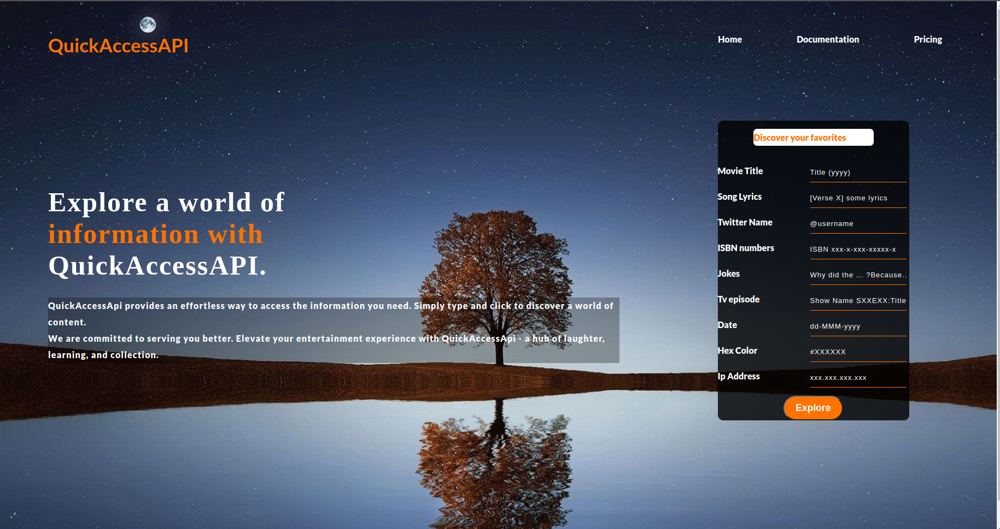
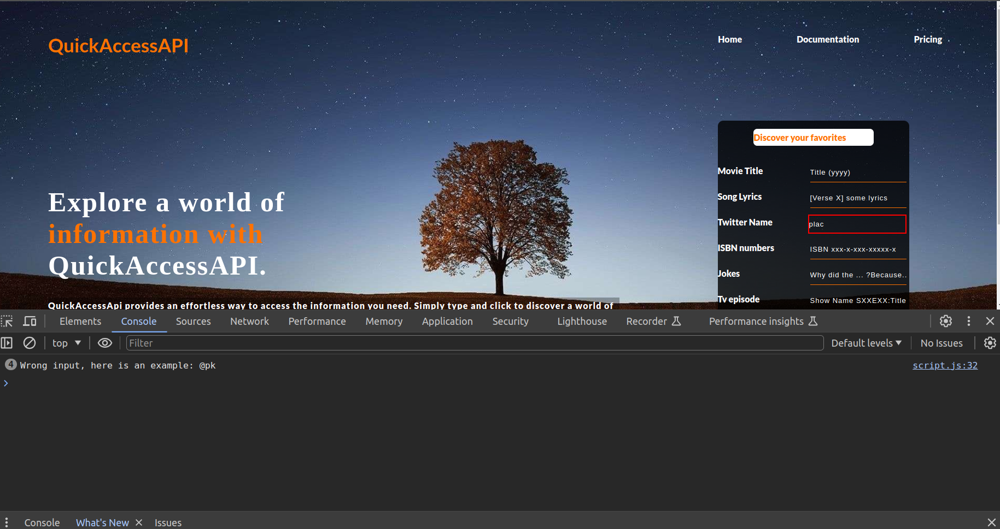
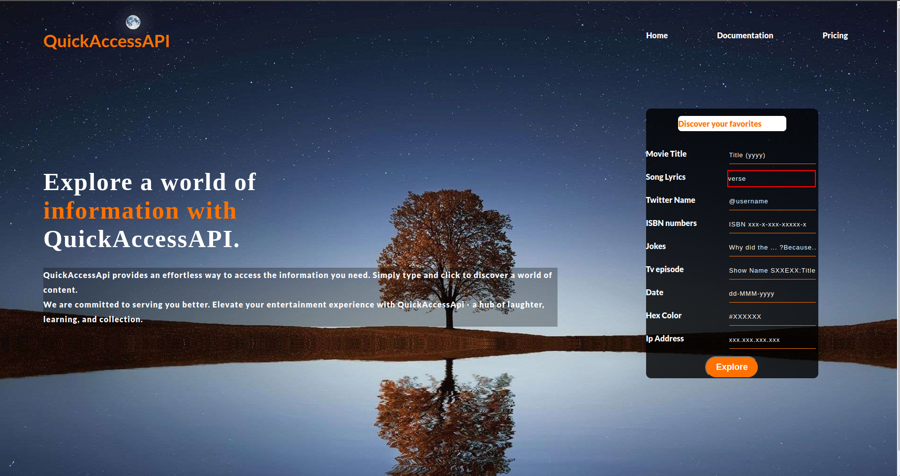

# alu_regex_hackathon

## Welcome to our repository 😇

## Table of contents

- [Description](#description)
- [Functionality Overview](#functionality-overview)
- [How to access our solution](#how-to-access-our-solution)
- [Built with](#built-with)
- [Authors](#authors)

## Description

In response to a February 2024 assignment called alu_regex_hackathon for first-year ALU students in their third term, our group opted to develop a straightforward web page. For this project, we integrated regular expressions using JavaScript to enhance the functionality of our chosen web application.

## Functionality Overview

our webpage contains a simple form, whereby we integrated in regular exxpressions,

### How it works

This is our webpage

The image illustrates that when you input a value in the correct format, matching the defined regular expression for a specific field, a green border is displayed to indicate that there are no errors.

The image illustrates that when you input a value in the wrong format, not matching the defined regular expression for a specific field, a red border is displayed that there are errors in your format.

he image displays the console output following an incorrect input format that does not match the specified regular expression for a particular field. It reveals an error message indicating the incorrect format and promptly provides an example illustrating the correct formatting for the input.

## How to access our solution

Open your web browser and then copy and paste this link, [regex-hackthon-solution](https://pimanzi.github.io/alu_regex_hackathon_group17/)

## Built with

1. Semantic HTML5 markup
2. Css custom properties
3. Javascript for our regex part

## Authors

1. [Imanzi Kabisa Placide](https://github.com/pimanzi)

2. [Ntawukamenya Palvis](https://github.com/Pntawukamenya)

3. [Iryivuze Daniel](https://github.com/Daniel-IRYIVUZE)

4. [Marvelous Nelson](https://github.com/mnelson-1)

5. [Jeremiah Agbaje](https://github.com/j-agbaje)
